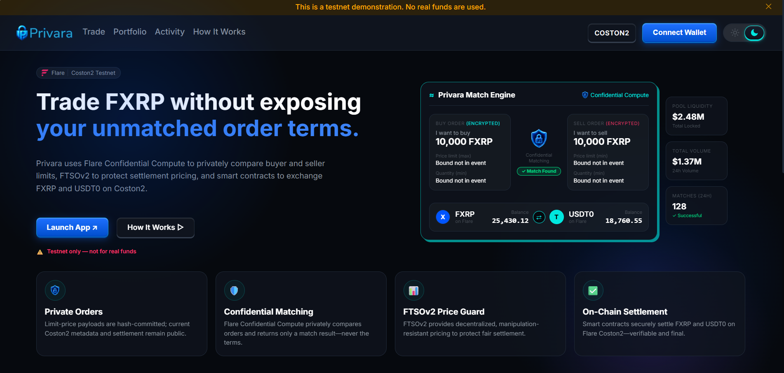
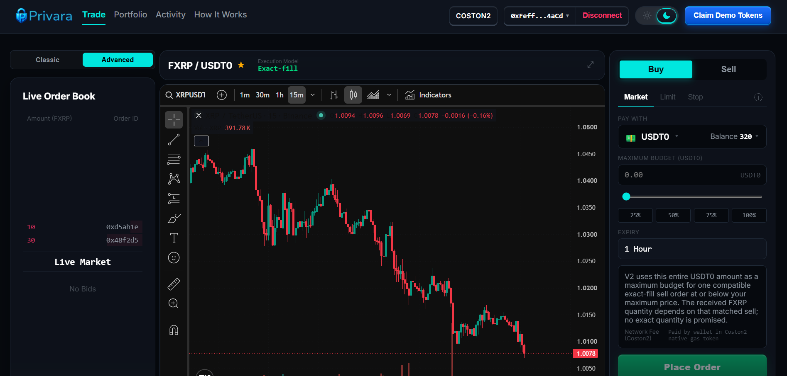
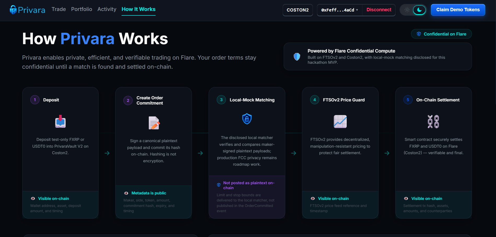

<p align="center">
  
</p>

# Privara — Confidential Darkpool DEX on Flare ([Link](https://privara-dapps.vercel.app))

> **Private orders. Fair settlement.**

Privara is a confidential darkpool DEX built on Flare for traders who want to execute FXRP trades without exposing their unmatched order terms to the public market.

Traditional on-chain order books expose information such as price limits, order sizes, and trading intent before settlement. For large traders, this information can become a signal for bots, MEV strategies, front-running, and other forms of adverse execution. Privara changes this model by separating confidential order matching from transparent on-chain settlement.

> *Keep trading intent private before a match, while keeping final settlement verifiable on-chain.*

The current Coston2 MVP is an intent matching and oracle guarded settlement prototype for a demo FXRP/USDT0 pair. Users deposit test assets, commit a hash of a maker signed order payload, and settle compatible orders through `PrivaraVault V2`. Settlement verifies an EIP 191 match signature and rejects execution prices that deviate by more than 200 basis points from Flare FTSOv2 XRP/USD.

## Screenshots

<p align="center">
  
</p>

<p align="center">
  
</p>

<p align="center">
  
</p>

## Problem & Solution

**The Problem:** Public order books reveal trading intent before execution. For large or price sensitive trades, visible limits expose strategy and create opportunities for front running and MEV. Fully opaque or centralized matching engines, on the other hand, weaken on chain verifiability and custody security. DeFi traders lack the infrastructure to protect their pre trade privacy while maintaining trustless execution.

**The Solution:** Privara introduces a **hybrid confidential operational layer** on the Flare blockchain. It separates concerns: compatible intent is evaluated confidentially off chain (via Flare Confidential Compute architecture), while custody, oracle validation, and settlement remain transparent and verifiable on Flare Coston2.

## Why Flare Network?

Flare provides high performance infrastructure optimized for data heavy and privacy centric applications. Privara uses Flare as the foundation for:
- **Verifiable Custody**: Smart contracts handle atomic execution on Coston2.
- **Trustless Oracle Guards**: FTSOv2 protects settlement, ensuring trades only execute within a fair market price range (200 bps deviation guard).
- **Confidential Intent Infrastructure**: FCC provides the target trust boundary for comparing sensitive intent and returning a signed result.

## Competitive Advantage

- **Confidential Pre trade Intent**: Traders can submit limit orders without exposing their strategy to the public mempool.
- **Oracle Guarded Settlement**: Zero risk of executing at an unfair price thanks to FTSOv2 integration.
- **Atomic Settlement**: Trades settle atomically on Coston2, ensuring zero counterparty risk.
- **Verifiable Transactions**: Vault accounting, commitments, and oracle checks are 100% verifiable onchain.

## Vision

Privara builds the privacy layer for FXRP and FAssets. Today, traders can match FXRP intents privately on Coston2. 

Our long-term vision is to make Flare a settlement layer for confidential institutional markets. The same architecture could eventually support:
- larger FXRP block trades,
- OTC-style execution,
- RFQ markets,
- institutional treasury trades,
- confidential token swaps,
- private auctions,
- and cross-asset darkpool liquidity.

Privara demonstrates how Flare Confidential Compute, FTSOv2, smart contracts, and XRP-related assets can work together to create a new category of privacy-preserving DeFi infrastructure.

## Current status

- Network: **Flare Coston2**, chain ID `114`.
- Contract version: **PrivaraVault V2**.
- Asset mode: **Coston2 mock/demo assets**, both 18 decimals.
- FCC infrastructure mode: **`local_mock`**.
- Verifier mode: **local EIP-191**, not an official FCC/TEE proof verifier.
- Source level development gates: **64 workspace tests** (**25 contract + 24 backend + 15 shared**), four-package workspace typecheck, production frontend build, **5/5 Playwright smoke tests**, and **6 focused Go packages** passed on the current working tree on 2026-08-11.
- Backend readiness after the oracle aware changes: `/health` ready on chain ID `114` in `local_mock` mode.
- Connected wallet browser E2E, live Market/Stop Coston2 transactions, and manual Alice/Bob acceptance/final transaction evidence are **not complete**.
- Release status: **NO-GO for final submission** until the transaction pack, scanner backed security evidence, public deployment links, video, fresh clone check, and exact release-SHA rerun are complete.

> **Required disclosure:** The Coston2 V2 demo uses test mock FXRP and mock USDT0 assets. It does not use real or production backed FAssets. The current matcher sees maker signed plaintext order payloads and runs in `local_mock` mode; it is not a production hardware TEE. Coston2 testnet only, not audited, not production-ready, and no real funds.

## Verified Coston2 V2 deployment

Canonical source: [`deployments/coston2.json`](deployments/coston2.json).

| Component | Address | Evidence |
|---|---|---|
| PrivaraVault V2 | `0x295ACfEce01513a360EA54768eB6efAf337a303E` | [Explorer](https://coston2-explorer.flare.network/address/0x295ACfEce01513a360EA54768eB6efAf337a303E) |
| Local EIP-191 verifier | `0xa05A5c13A3206B1b357EE2F7C576790428690992` | [Explorer](https://coston2-explorer.flare.network/address/0xa05A5c13A3206B1b357EE2F7C576790428690992) |
| Demo FXRP, 18 decimals | `0x883610C496161486b73412083073126d36167377` | [Explorer](https://coston2-explorer.flare.network/address/0x883610C496161486b73412083073126d36167377) |
| Demo USDT0, 18 decimals | `0x9d361B93A298CEe2bd3Ad85318EC82efe1aFdaC2` | [Explorer](https://coston2-explorer.flare.network/address/0x9d361B93A298CEe2bd3Ad85318EC82efe1aFdaC2) |
| FTSOv2 | `0x3d893C53D9e8056135C26C8c638B76C8b60Df726` | [Explorer](https://coston2-explorer.flare.network/address/0x3d893C53D9e8056135C26C8c638B76C8b60Df726) |

Deployment facts:

- Vault deploy block: `33902106`.
- Vault deploy transaction: [`0x61f4...d1d8`](https://coston2-explorer.flare.network/tx/0x61f4bb4bd3c1e3000c81d05ed47dac10b7f499a7e8345d82984e8914952fd1d8).
- XRP/USD feed ID: `0x015852502f55534400000000000000000000000000`.
- Maximum oracle deviation: `200 bps`.
- Maximum oracle age: `300 seconds`.
- Price scale: `1e18`.
- All recorded token, verifier, vault, immutable, metadata, signer-parity, and runtime code-hash deployment checks passed before canonical manifest promotion.

The demo tokens are `PrivaraDemoToken` contracts. Each supports one capped `claim()` per address and owner-only administrative `mint()`. They are test assets and have no production backing.

## Audited trade behavior

The prior production/Vercel visual layout has been restored for both **Classic** and **Advanced**:

- **Classic** remains the quick **Limit** experience because that is the original Classic layout.
- **Advanced** retains its existing **Market / Limit / Stop** tabs. All three are functional in `local_mock`.
- **Limit buy:** the entered amount is a maximum USDT0 budget for one compatible exact fill sell. It does **not** promise an exact FXRP quantity; the received FXRP depends on the compatible seller and execution price.
- **Limit sell:** the entered FXRP amount is exact and all or nothing.
- **Market:** this is not an unbounded order or a guarantee of immediate execution. At commitment time it derives a 1% collar from live FTSOv2: a buy commits the upper bound rounded up (`ceil`), while a sell commits the lower bound rounded down (`floor`).
- **Stop:** level triggered stop limit. A buy is eligible when `oracle >= stop` and its maximum price must be `>= stop`; a sell is eligible when `oracle <= stop` and its minimum price must be `<= stop`. Eligibility follows the current oracle condition, remains dormant before the condition is met, and is not permanently latched.
- **Partial fills are unsupported for every order type.** All successful matches remain exact-fill/all-or-nothing.

No V2 contract change was required: the opaque order commitment already binds `orderType`, `limitPrice`, and `stopPrice`, and the V2 match digest is unchanged. The backend now reads FTSOv2, enforces feed freshness, applies the oracle aware `<= 200 bps` / minimum settlement window, and fails closed for remote FCC operation.

The trade audit also aligned the UI and transaction lifecycle with V2: available, locked, and total balances are used; the withdrawal route works; faucet claim state is checked before offering a claim; cancellation waits for a successful receipt and supports expired orders; and direct contract status reads replace genesis to head event scans. Market and Stop confirmation now display the actual fixed FTSOv2 collar or stop trigger semantics, and Portfolio surfaces indexer failures as unknown state rather than authoritative zero. Stale encryption, identity private, and production like FCC wording found in the broader frontend review was replaced with explicit `local_mock`, public metadata, and hash not encryption disclosure.

These are source level implementation checks plus local automated evidence, not connected wallet browser E2E, live Market/Stop Coston2 transaction evidence, manual Alice/Bob acceptance, production TEE evidence, or a claim that the software is bug free.

## How it works

1. Alice deposits demo FXRP; Bob deposits demo USDT0.
2. The browser creates a canonical limit order payload and requests a maker signature.
3. The browser commits `hashOrder(payload)` to `PrivaraVault V2` and sends the maker signed plaintext payload to the local matcher.
4. The backend verifies the maker signature, chain ID, vault address, and payload commitment.
5. Compatible limits execute at their midpoint; the local mock attestation signer signs a domain separated V2 result.
6. `settle()` verifies order state, commitments, signature, amounts, expiry, replay protection, and the FTSOv2 deviation guard.
7. Vault balances update atomically and users can withdraw.

### Example Trade

**Alice** wants to sell 100 FXRP with a minimum acceptable price of 0.90 USDT0.
**Bob** wants to buy 100 FXRP with a maximum acceptable price of 1.00 USDT0.

Privara confidentially compares their limits. Because `0.90 <= 1.00`, the orders match.
- **Execution price:** (0.90 + 1.00) / 2 = 0.95 USDT0 per FXRP
- **Total settlement:** 100 × 0.95 = 95 USDT0

Privara then checks the execution price against FTSOv2. If the oracle guard passes:
- Bob receives 100 FXRP
- Alice receives 95 USDT0

The trade is finalized and settled on-chain.

### What Makes Privara Different?

Privara is not intended to be another AMM or public order-book DEX. It explores a completely different market structure:

**Public DEX**
> Public Order → Public Matching → Public Settlement

**Privara**
> Private Order → Confidential Matching → Oracle Validation → Public Settlement

The important innovation is not hiding blockchain settlement. It is preventing sensitive trading intent from becoming public before a trade has been executed.

### Architecture

Privara consists of several cooperating layers:

```text
User
 ↓
Privara Web App
 ↓
Privara Vault Smart Contract
 ↓
Private / Encrypted Order
 ↓
Privara Match Engine
 ↓
Flare Confidential Compute
 ↓
FTSOv2 Price Validation
 ↓
On-Chain FXRP / USDT0 Settlement
```

Each component has a different responsibility. The blockchain secures funds and settlement. Confidential computation protects trading intent. FTSOv2 protects settlement pricing.

### Privacy Model

Privara does not attempt to hide everything on the blockchain. Instead, it focuses privacy where it matters most for trading.

Before settlement, Privara is designed to protect information such as:
- buyer maximum price
- seller minimum price
- unmatched order conditions
- the relationship between potential counterparties

After settlement, blockchain information such as transactions, transferred assets, and settlement details can still be independently verified. This creates a practical balance between confidentiality before execution and verifiability after execution.

(Note: For the current Coston2 demo, the commitment is a hash, not encryption, and it runs in `local_mock` mode. It does not provide wallet anonymity or fully private production settlement yet.)

## Repository structure

- `smartcontract/` — V2 vault, local verifier, demo tokens, deployment scripts, and contract tests.
- `shared/` — canonical schemas, wire encoding, commitments, match IDs, and V2 digest helpers.
- `backend/` — event indexer, payload registry, matcher, local FCC adapter, and settlement relayer.
- `frontend/` — Next.js wallet UI for deposits, orders, portfolio, activity, and withdrawals.
- `flareconfidentialcompute/` — FCC scaffold and Go packages. The official remote FCC proof path is not yet the executable V2 submission path.
- `deployments/coston2.json` — verified public deployment manifest; never contains private keys.

## Local setup

Requirements:

- Node.js compatible with Next.js 14 and Hardhat.
- pnpm.
- Go for the focused FCC packages.

```powershell
pnpm install --frozen-lockfile
pnpm test
pnpm typecheck
pnpm build
pnpm --filter @privara/fe test:e2e
```

Focused Go suites:

```powershell
cd flareconfidentialcompute
go test ./internal/encoding ./internal/validation ./internal/matcher ./internal/engine ./internal/handler ./internal/extension
```

Copy `.env.example` to `.env` and provide local secrets. Never commit `.env` or expose private keys through `NEXT_PUBLIC_*` variables.

Start the backend:

```powershell
pnpm --filter @privara/be dev
```

Readiness endpoints:

```text
http://localhost:3001/live
http://localhost:3001/health
http://localhost:3001/status
```

Start the frontend in another terminal:

```powershell
pnpm --filter @privara/fe dev
```

Open `http://localhost:3000` and connect to Coston2.

## Safety and trust assumptions

- `local_mock` signer integrity is currently trusted for match authorization, but the vault independently enforces commitments, amounts, expiry, replay protection, token direction, reserved balances, and FTSOv2 price bounds.
- The mock signer must remain separate from deployer/owner/matcher roles and should not receive demo assets or unrelated authority.
- Payload and in flight registries are currently in memory; durable restart recovery remains incomplete.
- Expired orders may require cancellation to release locked balance.
- Official FCC request/proof schema, official onchain verifier integration, extension measurement binding, and full Go V2 match result parity remain future work.
- Contracts have not received a formal external audit.

## Remaining release gates

Before describing Privara as a fully accepted working demo or submitting the final release:

- Complete a two wallet Coston2 trade and record deposit, order, settlement, withdrawal, and final balance evidence.
- Demonstrate live cancellation, incompatible limits, expiry, duplicate settlement prevention, and oracle deviation rejection.
- Add live Market/Stop Coston2 transaction evidence and connected wallet browser write/receipt E2E.
- Populate `deployments/coston2.json` examples and `docs/testing/INTEGRATION_TEST_RESULTS.md`.
- Run documented tree and history secret scanning, prove published fixture addresses have no canonical role/assets, and review generated artifacts without reproducing credentials.
- Repair and verify fresh clone retrieval for the FCC scaffold, pin Node/pnpm versions, and credit the exact upstream source/version.
- Push the audited V2 state, then repeat tests, typecheck, build, Go suites, and browser smoke on the exact clean release SHA.
- Publish and verify the canonical frontend, backend, technical docs, explorer evidence, and demo video URLs without authentication.
- Fill the exact official bounty, deadline, submission form, evidence ledger, and all remaining required placeholders.

Repository/access status as of 2026-08-11: the GitHub repository is public and canonical V2 explorer links resolve, but public source parity, fresh clone verification, and final release/tag evidence remain open.

## Roadmap

1. Move matching to official FCC/TEE infrastructure with a pinned proof schema and verifier.
2. Persist payloads, FCC jobs, and index checkpoints with reorg safe recovery.
3. Reduce pre settlement metadata exposure and add partial fills.
4. Obtain an external security review before any mainnet consideration.
5. Validate additional real FAssets only after decimal aware protocol and UI support.

## Submission links

- Repository: `https://github.com/asamarsal/Privara`
- Live application: `https://privara-dapps.vercel.app/`
- Demo video: `[DEMO_VIDEO_URL]`
- Exact official bounty: `Track 2 - Confidential Compute Apps.`

Privara is a hackathon demonstration on Flare Coston2. It must not be used with real funds.
